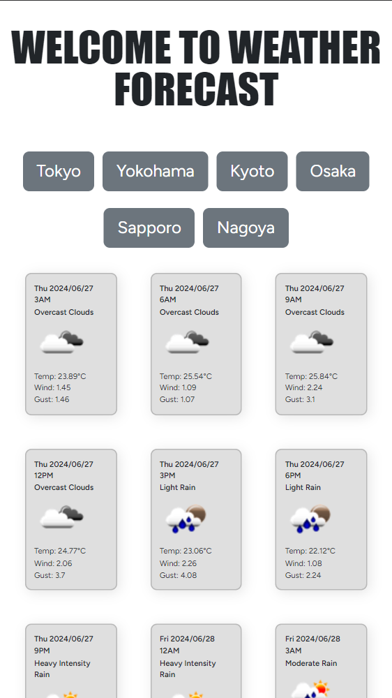
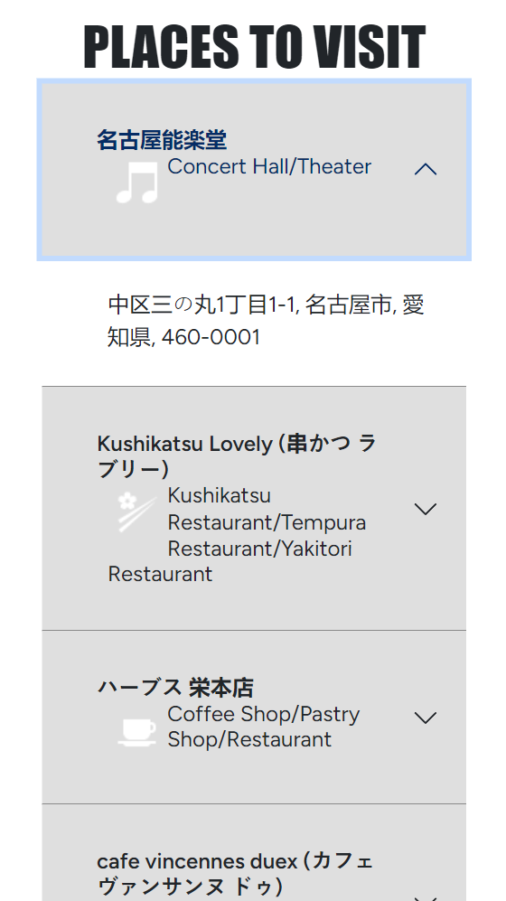

## Why I choose this UI and code implementation:

I chose this UI to be a 1 pager for very simple experience for the users, thay just have to tap where to go, and the informations including weather forecast and places to go are displayed immediately.

The backend is very straightforward, I used Vue Router to route Vue which sits inside Laravel project to consume API responses. I worked with controllers and services, I used single responsibility principle for 2 different routes of Weather and Place. For services, I just requested information from third party APIs, tweak some informations like converting date, etc. and then return them to response. I used config and env for basic informations that could change in the future so no development needed including third party URLs, api keys, limits and date format.